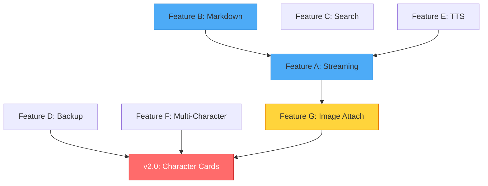

# Pocket Waifu — Next Roadmap & Feature Plan

> **Version**: 1.0  
> **Date**: 2026-03-01  
> **App Version**: v1.0.0+1 → Targeting v2.0.0  

---

## Table of Contents

1. [Project Status Overview](#1-project-status-overview)
2. [Minor Feature Additions (v1.x Patches)](#2-minor-feature-additions-v1x-patches)
3. [Major Update — Character Card System (v2.0)](#3-major-update--character-card-system-v20)
4. [Implementation Priority & Timeline](#4-implementation-priority--timeline)
5. [Technical Dependency Map](#5-technical-dependency-map)

---

## 1. Project Status Overview

### 1.1 Current Architecture Summary

```
Pocket Waifu v1.0.0
├── Core Chat System
│   ├── Multi-session management (create, rename, delete, export)
│   ├── Prompt Block system (custom prompt structure editor)
│   ├── Prompt Presets
│   └── Command parser (/del, /send, /edit, etc.)
│
├── API Integration
│   ├── OpenAI-compatible API support
│   ├── Anthropic API support
│   ├── GitHub Copilot API support
│   ├── Custom API presets (multi-config CRUD)
│   ├── Parameter tuning (temperature, top_p, penalties, max_tokens)
│   └── Connection testing
│
├── Post-Processing Pipeline
│   ├── Regex pipeline (prompt injection rules)
│   └── Lua scripting service (custom script hooks)
│
├── Live2D System
│   ├── Native OpenGL overlay
│   ├── Transparent background rendering
│   ├── Display edit mode (position, scale, rotation)
│   ├── Hitbox system
│   ├── Model scanner & loader
│   ├── LLM directive parsing (motion/expression control)
│   └── Advanced settings (WIP — motions, gestures, interactions)
│
├── Notification & Proactive Response
│   ├── Proactive response timer service
│   ├── Notification coordinator
│   └── Foreground service
│
├── Customization
│   ├── Theme editor (custom color presets)
│   ├── Dark mode toggle
│   └── Character name editing
│
└── Infrastructure
    ├── Release logging service
    ├── Global runtime on/off switch
    ├── SharedPreferences persistence
    └── Permission handler
```

### 1.2 Key Gaps Identified

| Area | Gap | Impact |
|------|-----|--------|
| **Input modality** | Text-only — no image/file/voice support | Users cannot share visual context with the LLM |
| **Character management** | Single hardcoded character — no import/export | Users must manually edit character fields; no sharing ecosystem |
| **Chat UX** | No streaming response display | Users wait for full response before seeing any text |
| **Chat UX** | No markdown rendering in messages | Code blocks, bold, links display as raw text |
| **Chat UX** | No message search or bookmarking | Hard to find past conversations |
| **Data portability** | No backup/restore system | All data lost on app reinstall |
| **Localization** | Korean-only (hardcoded strings) | Limits international user base |
| **TTS/STT** | No voice interaction | No hands-free or voice-based chat |
| **Screen context** | No image or screen share support | LLM cannot see what user sees |

---

## 2. Minor Feature Additions (v1.x Patches)

### Feature A — Streaming Response Display

**Priority**: 🔴 High  
**Effort**: ~3 days  
**Version**: v1.1.0

#### Problem
Currently, the app waits for the full API response to arrive before displaying any text. Users see a loading spinner for potentially 10–30 seconds with no feedback.

#### Solution
Implement Server-Sent Events (SSE) streaming for both OpenAI and Anthropic APIs.

#### Technical Changes

| File | Change |
|------|--------|
| `api_service.dart` | Add `sendMessageStream()` using `http.Client.send()` with `StreamedResponse`. Parse SSE `data:` lines incrementally. |
| `chat_provider.dart` | Add `_streamingContent` field. Update UI on each chunk via `notifyListeners()`. |
| `chat_screen.dart` | Show growing text in message bubble during streaming. Add typing indicator animation. |

#### Payload Changes
```json
// Add to OpenAI request body:
{ "stream": true }

// Add to Anthropic request body:
{ "stream": true }
```

#### UX Behavior
```
User sends message
  → Spinner for 0.5–2s (network latency)
  → Text appears character-by-character / chunk-by-chunk
  → Typing cursor (▌) blinks at the end of text
  → When stream ends, cursor disappears, message finalized
```

---

### Feature B — Markdown Rendering in Chat Bubbles

**Priority**: 🟡 Medium  
**Effort**: ~2 days  
**Version**: v1.1.0

#### Problem
LLM responses often contain markdown (code blocks, bold, lists, headers), but the current chat bubble renders everything as plain text.

#### Solution
Use `flutter_markdown` package to render message content.

#### Technical Changes

| File | Change |
|------|--------|
| `pubspec.yaml` | Add `flutter_markdown` + `url_launcher` (for link taps) |
| `chat_screen.dart` (`_MessageBubble`) | Replace `SelectableText` with `MarkdownBody` for assistant messages |

#### Supported Rendering
- **Code blocks** — syntax-highlighted with dark background, copy button
- **Inline code** — monospace with subtle background
- **Bold / Italic** — text styling
- **Lists** — ordered and unordered
- **Headers** — h1–h3 sizing
- **Links** — tappable, opens browser
- **Tables** — basic rendering

---

### Feature C — Chat Search & Bookmark

**Priority**: 🟡 Medium  
**Effort**: ~3 days  
**Version**: v1.2.0

#### Problem
Users cannot search through past messages. With multiple sessions and long conversations, finding specific content is impossible.

#### Solution
Add a search bar to the chat screen and a bookmark feature for important messages.

#### New Components

```
1. Search Mode:
   ┌────────────────────────────────────┐
   │ 🔍 [Search text...        ] [✕]   │
   │                                    │
   │  ↕ Result 3 of 17                  │
   │  [▲ Prev] [▼ Next]                │
   ├────────────────────────────────────┤
   │  (messages scroll to match)        │
   └────────────────────────────────────┘

2. Bookmarked Messages:
   - Long-press message → context menu → "Bookmark"
   - Bookmarked messages have a ⭐ indicator
   - "Bookmarks" filter in chat list screen
```

#### Technical Changes

| File | Change |
|------|--------|
| `message.dart` | Add `bool isBookmarked` field to `Message` model |
| `chat_screen.dart` | Add search bar toggle, highlight matching text, scroll-to-match |
| `chat_session_provider.dart` | Add `searchMessages(String query)` method |
| `chat_list_screen.dart` | Add bookmark filter toggle |

---

### Feature D — Data Backup & Restore

**Priority**: 🔴 High  
**Effort**: ~2 days  
**Version**: v1.2.0

#### Problem
All app data (chat sessions, settings, characters, prompt blocks, themes) is stored in SharedPreferences with no backup mechanism. App uninstall = total data loss.

#### Solution
Export all data as a single encrypted JSON archive, importable on any device.

#### Export/Import Format

```json
{
  "format": "pocket_waifu_backup",
  "version": 2,
  "exportedAt": "2026-03-01T12:00:00Z",
  "data": {
    "settings": { ... },
    "character": { ... },
    "chatSessions": [ ... ],
    "promptBlocks": [ ... ],
    "promptPresets": [ ... ],
    "themePresets": [ ... ],
    "apiConfigs": [ ... ],
    "notificationSettings": { ... }
  }
}
```

#### UX Flow
```
Export:
  Menu → Settings → [Export All Data]
  → Choose save location (file_picker)
  → Save as "pocket_waifu_backup_2026-03-01.json"
  → Success confirmation

Import:
  Menu → Settings → [Import Data]
  → Pick .json file
  → Preview dialog showing what will be imported
  → [Merge] or [Replace] option
  → Confirm → Data restored
```

---

### Feature E — TTS (Text-to-Speech) for Assistant Messages

**Priority**: 🟢 Low  
**Effort**: ~2 days  
**Version**: v1.3.0

#### Problem
No audio output for character responses. Users must read everything visually.

#### Solution
Add TTS support using Android's built-in `TextToSpeech` engine via `flutter_tts` package.

#### Features
- **Per-message playback**: Tap 🔊 icon on any assistant message to hear it
- **Auto-play option**: Automatically read new assistant messages aloud
- **Voice settings**: Speed, pitch, language, engine selection
- **Streaming TTS**: Begin speaking as streaming chunks arrive (Feature A synergy)

#### Technical Changes

| File | Change |
|------|--------|
| `pubspec.yaml` | Add `flutter_tts` dependency |
| `services/tts_service.dart` | **NEW** — TTS wrapper with queue management |
| `chat_screen.dart` | Add 🔊 icon to assistant message bubbles |
| `settings_screen.dart` | Add TTS settings section (speed, pitch, auto-play toggle) |
| `models/settings.dart` | Add `ttsEnabled`, `ttsSpeed`, `ttsPitch`, `ttsAutoPlay` fields |

---

### Feature F — Multi-Character Profile System

**Priority**: 🟡 Medium  
**Effort**: ~3 days  
**Version**: v1.3.0

#### Problem
The app has a single `Character` instance with basic fields. Users cannot switch between characters or save multiple profiles.

#### Solution
Extend the character system to support multiple saved profiles with easy switching.

#### Features
- **Character list** with thumbnail, name, and description preview
- **Switch character** without losing chat history (sessions are independent)
- **Duplicate** an existing character as a template
- **Associate sessions** with characters (visual indicator in chat list)
- **Default character** indicator

#### Technical Changes

| File | Change |
|------|--------|
| `models/character.dart` | Add `avatarPath`, `tags`, `createdAt` fields |
| `providers/character_provider.dart` | **NEW** — CRUD for multiple characters, load/save to SharedPreferences |
| `screens/character_list_screen.dart` | **NEW** — Character grid/list with management UI |
| `screens/character_editor_screen.dart` | **NEW** — Full character editing form |
| `screens/menu_drawer.dart` | Add "Characters" section |
| `models/chat_session.dart` | `characterId` already exists — ensure it works properly |

---

### Feature G — Image Attachment & Screen Share

**Priority**: 🔴 High  
**Effort**: ~4 weeks  
**Version**: v1.4.0

> This feature has its own dedicated plan document.  
> See: [풀리퀘.md](./풀리퀘.md)

#### Summary
- Image attachment button on chat screen
- Camera/gallery image picker
- Multimodal API payload support (OpenAI Vision + Anthropic Vision)
- Android MediaProjection screen capture
- Screen Share settings tab in menu

---

## 3. Major Update — Character Card System (v2.0)

### 3.1 Overview

The **Character Card System** is the single largest feature planned for v2.0. It transforms Pocket Waifu from a single-character chat app into a full **character creation, import, and sharing platform** — compatible with the wider AI roleplay ecosystem.

### 3.2 What Are Character Cards?

Character cards (also called "character files" or "bot cards") are a standardized format used across AI chat platforms (SillyTavern, TavernAI, Kobold, etc.) to package a character's identity, personality, and conversation setup into a single shareable file.

**Standard formats:**
- **PNG cards** — Character image with JSON metadata embedded in PNG `tEXt` chunks
- **JSON cards** — Raw JSON character definition
- **CHARX** — ZIP archive with character data + assets

### 3.3 Supported Specifications

| Spec | Version | Description |
|------|---------|-------------|
| **TavernAI Card V1** | Legacy | Basic fields: `name`, `description`, `personality`, `scenario`, `first_mes`, `mes_example` |
| **TavernAI Card V2** | Current Standard | Extends V1 with `character_book` (lorebook/world info), `system_prompt`, `post_history_instructions`, `alternate_greetings`, `tags`, `creator`, `creator_notes`, `extensions` |
| **Character Card V3** (Chara spec) | Emerging | Adds `assets` (multi-file bundles), `group_only_greetings`, richer metadata |

### 3.4 Data Model

```dart
class CharacterCard {
  // ── Core Identity ──
  final String name;
  final String description;
  final String personality;
  final String scenario;
  final String firstMessage;
  final List<String> alternateGreetings;
  final String exampleDialogue;
  
  // ── System Configuration ──
  final String systemPrompt;
  final String postHistoryInstructions;
  final String creatorNotes;
  final String creator;
  final String characterVersion;
  final List<String> tags;
  
  // ── World Info / Lorebook ──
  final CharacterBook? characterBook;
  
  // ── Visual ──
  final String? avatarBase64;      // embedded PNG
  final String? avatarPath;        // local file path
  
  // ── Extensions ──
  final Map<String, dynamic> extensions;  // future-proof
}

class CharacterBook {
  final String name;
  final String description;
  final List<CharacterBookEntry> entries;
}

class CharacterBookEntry {
  final List<String> keys;           // trigger keywords
  final String content;              // injected text
  final bool enabled;
  final int insertionOrder;
  final String position;             // "before_char", "after_char", etc.
  final bool caseSensitive;
  final int priority;
  final bool constantEntry;          // always inject, ignore keys
}
```

### 3.5 Feature Breakdown

#### 3.5.1 Character Card Import

```
Supported import sources:
├── Local file picker (.png, .json, .charx)
├── URL import (paste link to character card)
├── Clipboard paste (JSON text)
└── Share intent (receive from other apps)
```

**PNG Card Import Pipeline:**
```
1. User picks PNG file
2. Read PNG tEXt chunks → find "chara" key
3. Base64 decode → JSON string
4. Parse as V2 spec (fallback V1)
5. Map to CharacterCard model
6. Show preview dialog:
   ┌──────────────────────────────────┐
   │  [Avatar]  Character Name        │
   │            by @creator            │
   │                                   │
   │  Description preview...           │
   │  Tags: [tag1] [tag2] [tag3]       │
   │                                   │
   │  ⊞ Lorebook: 12 entries           │
   │  ⊞ Alternate greetings: 3         │
   │                                   │
   │  [Cancel]  [Import]               │
   └──────────────────────────────────┘
7. On confirm → save to local storage
```

#### 3.5.2 Character Card Export

```
Export formats:
├── PNG card (character image + embedded JSON)
├── JSON file (raw character data)
└── Share intent (send to other apps)
```

**PNG Card Export Pipeline:**
```
1. Serialize CharacterCard → V2 JSON
2. Base64 encode JSON string
3. Read avatar image (or generate placeholder)
4. Write JSON into PNG tEXt chunk with key "chara"
5. Save PNG to user-chosen location
```

#### 3.5.3 Character Card Editor

A full-featured editor screen with sections:

```
┌─────────────────────────────────────────┐
│         Character Card Editor           │
├─────────────────────────────────────────┤
│                                         │
│  [Avatar Upload/Change]                 │
│                                         │
│  📝 Basic Info                          │
│  ├─ Name                                │
│  ├─ Description                         │
│  ├─ Personality                         │
│  └─ Scenario                            │
│                                         │
│  💬 Messages                            │
│  ├─ First Message                       │
│  ├─ Alternate Greetings [+Add]          │
│  │   ├─ Greeting 1  [Edit] [Delete]     │
│  │   └─ Greeting 2  [Edit] [Delete]     │
│  └─ Example Dialogue                    │
│                                         │
│  ⚙️ System                              │
│  ├─ System Prompt                       │
│  └─ Post-History Instructions           │
│                                         │
│  📚 World Info / Lorebook               │
│  ├─ Entry 1: "keyword" → ...  [Edit]    │
│  ├─ Entry 2: "keyword" → ...  [Edit]    │
│  └─ [+ Add Entry]                       │
│                                         │
│  🏷️ Metadata                            │
│  ├─ Creator                             │
│  ├─ Version                             │
│  ├─ Tags                                │
│  └─ Creator Notes                       │
│                                         │
│  [Preview] [Save] [Export]              │
│                                         │
└─────────────────────────────────────────┘
```

#### 3.5.4 World Info / Lorebook Engine

The lorebook system dynamically injects context into the prompt based on keyword detection in the conversation.

**Runtime Behavior:**
```
1. User sends message OR assistant response received
2. Scan last N messages for lorebook entry keywords
3. For each matching entry:
   a. Check if entry is enabled
   b. Check if entry is already injected (avoid duplicates)
   c. Sort by priority and insertion order
   d. Inject content at configured position:
      ├─ "before_char" → before character description
      ├─ "after_char"  → after character description
      └─ "@depth N"    → N messages from the end
4. Constant entries always inject regardless of keywords
5. Respect token budget — don't inject if would exceed limit
```

**Integration with Prompt Blocks:**
```
Current pipeline:
  PromptBlocks → buildFinalPrompt → API

With Lorebook:
  PromptBlocks + LorebookMatches → buildFinalPrompt → API

New PromptBlock type: "lorebook_inject"
  → Automatically populated by lorebook engine
  → Position and order determined by entry config
```

#### 3.5.5 Character Gallery Screen

```
┌─────────────────────────────────────────┐
│         My Characters                   │
│  [🔍 Search]              [+ Import]    │
├─────────────────────────────────────────┤
│                                         │
│  ┌─────┐ ┌─────┐ ┌─────┐ ┌─────┐      │
│  │     │ │     │ │     │ │     │      │
│  │ 🖼️ │ │ 🖼️ │ │ 🖼️ │ │ 🖼️ │      │
│  │     │ │     │ │     │ │     │      │
│  ├─────┤ ├─────┤ ├─────┤ ├─────┤      │
│  │Mika │ │Luna │ │Hana │ │Rex  │      │
│  │ ★   │ │     │ │     │ │     │      │
│  └─────┘ └─────┘ └─────┘ └─────┘      │
│                                         │
│  ┌─────┐ ┌─────────────────────┐       │
│  │     │ │                     │       │
│  │  +  │ │  Empty slots...     │       │
│  │     │ │                     │       │
│  └─────┘ └─────────────────────┘       │
│                                         │
│  Long-press card → Context menu:       │
│  ├─ Edit                                │
│  ├─ Duplicate                           │
│  ├─ Export (PNG / JSON)                  │
│  ├─ Set as Default                      │
│  └─ Delete                              │
│                                         │
└─────────────────────────────────────────┘
```

### 3.6 Affected Files & New Files

#### New Files

| File | Purpose |
|------|---------|
| `lib/models/character_card.dart` | CharacterCard, CharacterBook, CharacterBookEntry models |
| `lib/services/character_card_parser.dart` | PNG tEXt chunk reader/writer, V1/V2/V3 JSON parser |
| `lib/services/lorebook_engine.dart` | Runtime keyword matching and context injection |
| `lib/providers/character_provider.dart` | Multi-character CRUD, persistence, active character state |
| `lib/screens/character_gallery_screen.dart` | Character grid view with import/export actions |
| `lib/screens/character_editor_screen.dart` | Full character card editor form |
| `lib/screens/lorebook_editor_screen.dart` | Lorebook entry CRUD UI |
| `lib/widgets/character_card_preview.dart` | Import preview dialog widget |
| `lib/widgets/character_avatar.dart` | Avatar display widget with placeholder generation |

#### Modified Files

| File | Change |
|------|--------|
| `lib/models/character.dart` | Extend or replace with `CharacterCard` — maintain backward compatibility |
| `lib/services/prompt_builder.dart` | Integrate lorebook injection into `buildFinalPrompt()` |
| `lib/providers/settings_provider.dart` | Delegate character management to `CharacterProvider` |
| `lib/screens/menu_drawer.dart` | Add "Characters" section linking to gallery |
| `lib/screens/chat_screen.dart` | Show active character avatar in app bar |
| `lib/screens/chat_list_screen.dart` | Show character name/avatar per session |
| `lib/main.dart` | Register `CharacterProvider` in `MultiProvider` |
| `pubspec.yaml` | Add `image` package (for PNG tEXt chunk manipulation), `archive` (for CHARX) |

### 3.7 Migration Strategy

```
v1.0 Character (current)          v2.0 CharacterCard
┌─────────────┐                  ┌──────────────────────┐
│ id          │ ──────────────── │ id                   │
│ name        │ ──────────────── │ name                 │
│ description │ ──────────────── │ description          │
│ personality │ ──────────────── │ personality          │
│ scenario    │ ──────────────── │ scenario             │
│ firstMessage│ ──────────────── │ firstMessage         │
│ exampleDia. │ ──────────────── │ exampleDialogue      │
│             │                  │ alternateGreetings    │ NEW
│             │                  │ systemPrompt          │ NEW
│             │                  │ postHistoryInstr.     │ NEW
│             │                  │ characterBook         │ NEW
│             │                  │ avatarBase64          │ NEW
│             │                  │ creator               │ NEW
│             │                  │ creatorNotes          │ NEW
│             │                  │ characterVersion      │ NEW
│             │                  │ tags                  │ NEW
│             │                  │ extensions            │ NEW
└─────────────┘                  └──────────────────────┘

On first v2.0 launch:
  1. Read existing Character from SharedPreferences
  2. Map to CharacterCard with new fields defaulting to empty
  3. Save as the first entry in the character gallery
  4. Set as active character
  5. Remove old character key from SharedPreferences
```

### 3.8 Implementation Phases

#### Phase 1 — Foundation (Week 1–2)
- [ ] Define `CharacterCard`, `CharacterBook`, `CharacterBookEntry` models
- [ ] Implement `CharacterCardParser` (V1/V2 JSON read/write)
- [ ] Implement PNG tEXt chunk reader/writer
- [ ] Unit tests for all parsing (use sample cards from SillyTavern)

#### Phase 2 — Storage & Provider (Week 3)
- [ ] Implement `CharacterProvider` with multi-character CRUD
- [ ] Data migration logic (v1 Character → v2 CharacterCard)
- [ ] Register in `main.dart` MultiProvider
- [ ] Persistence to SharedPreferences (or migrate to local JSON files for larger data)

#### Phase 3 — Import/Export UI (Week 4)
- [ ] Character gallery screen (grid layout)
- [ ] Import flow: file picker → parse → preview → save
- [ ] Export flow: select format → serialize → save/share
- [ ] Integration with menu drawer

#### Phase 4 — Editor (Week 5)
- [ ] Full character card editor screen
- [ ] Alternate greetings management
- [ ] Avatar upload/change
- [ ] Metadata fields

#### Phase 5 — Lorebook Engine (Week 6)
- [ ] Keyword matching engine
- [ ] Lorebook editor screen (entry CRUD)
- [ ] Integration with `PromptBuilder`
- [ ] Token budget enforcement
- [ ] Runtime injection testing

#### Phase 6 — Polish & Integration (Week 7)
- [ ] Character avatar in app bar and chat list
- [ ] Session ↔ character association
- [ ] Default character handling
- [ ] End-to-end import → chat → export testing

---

## 4. Implementation Priority & Timeline

```
                    2026
        Mar         Apr         May         Jun
Week:   1  2  3  4  5  6  7  8  9  10 11 12 13
        ─────────────────────────────────────────
v1.1.0  ██ ██ ██
        │  │  └─ Markdown Rendering (Feature B)
        │  └──── Streaming Response (Feature A)
        └─────── Image & Screen Share start (Feature G Phase 1–2)

v1.2.0           ██ ██ ██
                 │  │  └─ Data Backup/Restore (Feature D)
                 │  └──── Chat Search & Bookmark (Feature C)
                 └─────── Image & Screen Share cont. (Feature G Phase 3–4)

v1.3.0                    ██ ██
                          │  └─ Multi-Character Profiles (Feature F)
                          └──── TTS Support (Feature E)

v2.0.0                         ██ ██ ██ ██ ██ ██ ██
                               └── Character Card System (full 7 phases)
```

### Priority Order (if time-constrained)

| Priority | Feature | Rationale |
|----------|---------|-----------|
| 1️⃣ | Streaming Response (A) | Biggest UX improvement per effort |
| 2️⃣ | Markdown Rendering (B) | Makes LLM responses readable |
| 3️⃣ | Data Backup/Restore (D) | Prevents data loss — critical safety net |
| 4️⃣ | Image Attachment (G) | Unlocks vision models — modern LLM capability |
| 5️⃣ | Character Card System (v2.0) | Transforms app into a platform |
| 6️⃣ | Chat Search & Bookmark (C) | Quality-of-life improvement |
| 7️⃣ | Multi-Character Profiles (F) | Precursor to Character Cards; can merge into v2.0 |
| 8️⃣ | TTS Support (E) | Nice-to-have; lower impact |

---

## 5. Technical Dependency Map



**Key Dependencies:**
- **Streaming (A)** should be done before TTS (E), since TTS benefits from streaming chunks
- **Multi-Character (F)** should be done before or merged with Character Cards (v2.0)
- **Backup/Restore (D)** must handle the v2.0 character card format — design the backup format to be forward-compatible
- **Image Attachment (G)** changes the message type from `Map<String, String>` to `Map<String, dynamic>` — this is a prerequisite for any future multimodal features
- **Markdown Rendering (B)** has no hard dependencies — can be implemented at any time

---

> [!IMPORTANT]
> The **Character Card System (v2.0)** is the transformative update that positions Pocket Waifu as a proper SillyTavern-class mobile client. All v1.x features should be designed with forward compatibility in mind — especially the message model changes (Feature G) and character system (Feature F).

> [!TIP]
> The v1.1.0 features (Streaming + Markdown) offer the highest **user-perceived improvement per development hour**. Shipping these first will dramatically improve daily usability while larger features are in development.
